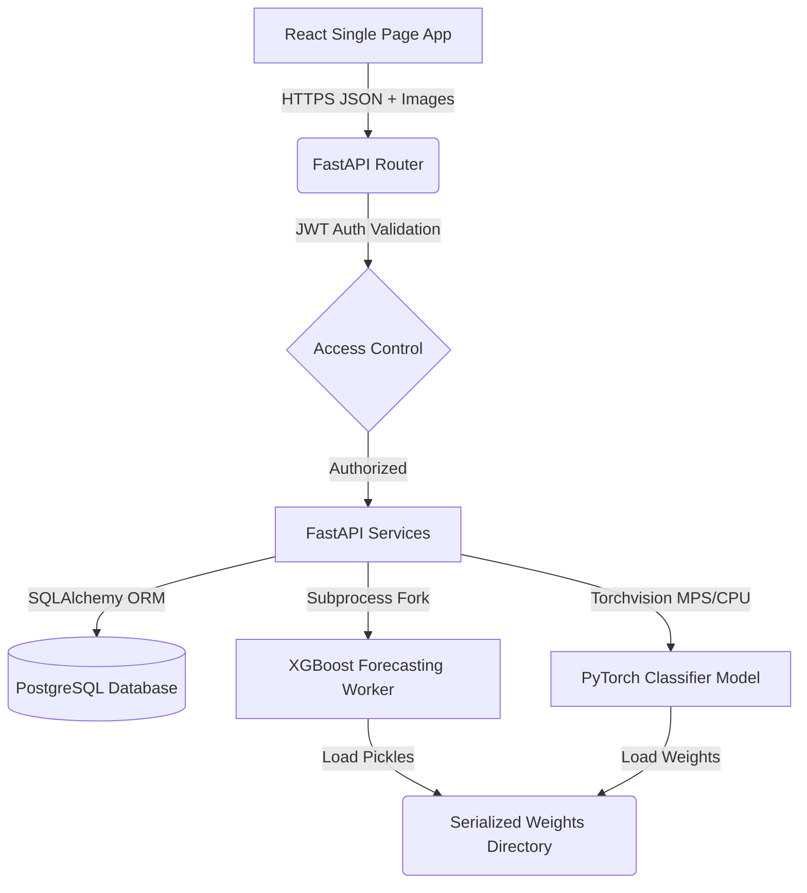

# SelfStack: AI-Powered Retail Supply Chain & Inventory Automation
<!--
Marp slide presentation markup.
Can be rendered directly using Marp CLI or VS Code extensions.
-->

---

# SLIDE 1: Title Slide
## **SelfStack**
### *AI-Powered Retail Inventory & Supply Chain Automation System*

**An end-to-end framework integrating Computer Vision, Autoregressive Time-Series Forecasting, and Automated Procurement.**

* **Presenter**: AI Engineering and Architecture Review Team
* **Role**: Lead Systems Architect & Senior ML Engineer
* **Version**: 1.0.0 (Release Version)

---

# SLIDE 2: Executive Summary
### **The Core Mission**
* **SelfStack** is a multi-tier solution designed to bridge store shelf physical states with back-end supplier replenishment loops.
* Resolves the dual retail failure points: **Stockouts** (missed revenue) and **Overstocking** (wasted capital/spoilage).
* Combines **Computer Vision (MobileNetV2)**, **Predictive Analytics (XGBoost)**, and **Supplier Rating Audits** in a unified dashboard.

---

# SLIDE 3: The Retail Dilemma
### **Reactive vs. Proactive Management**
* **Reactive (Traditional)**:
  * Visual inspection of shelves by staff.
  * Late order submissions to distributors.
  * Inability to predict sudden demand spikes.
* **Proactive (SelfStack)**:
  * Regular image scans audit shelf occupancy.
  * ML models forecast demand using historical lags, calendar, and weather trends.
  * Auto-generation of restocking orders based on safety thresholds.

---

# SLIDE 4: Platform Ideology
```
  [ Store Shelves ]  ◄── Image Scan (MobileNetV2 Category Classifier)
         │
         ▼
  [ Inventory Log ]  ◄── Automated Stock Decrement upon POS Sales
         │
         ▼
  [ Forecasting ]    ◄── XGBoost Demand Engine (Weather & Festival Aware)
         │
         ▼
  [ Procurement ]    ◄── Automatic Reorder Alerts & Performance Auditing
```

---

# SLIDE 5: High-Level Architecture
### **Technology Stack**
* **Frontend UI**: Vite + React 18, TailwindCSS v4, Recharts.
* **API Service**: FastAPI (Python), Pydantic validation schemas.
* **Database**: PostgreSQL (relational database managed via SQLAlchemy).
* **ML Engines**: PyTorch (Vision) + XGBoost (Time-Series Forecasting).
* **Security Layer**: JSON Web Tokens (JWT) + Role-Based Access Control (RBAC).

---

# SLIDE 6: System Block Diagram


---

# SLIDE 7: High-Level Process Flow
1. **Catalog & Database Seeding**: System is initialized with catalog products, distributors, and historical transactions.
2. **Sales Logging**: POS sales deduct quantities from `Inventory` and register logs.
3. **Daily Forecasting**: The system calculates a rolling average of transactions to predict the next 7-30 days of sales.
4. **Replenishment Loop**: When inventory drops below the predicted demand + safety stock, the supplier is alerted and a procurement order is created.

---

# SLIDE 8: Main Directory Layout
* `backend/`: Core REST API service, services, ORM models, database engines, and AI modules.
* `frontend/`: Single Page Application (components, context providers, services, page containers).
* `ml/`: Model training pipelines (features preparation, train routines, EDA notebooks).
* `models/`: Weights (`.pt`), regressors (`.pkl`), metrics reports, and FAISS indices.
* `datasets/`: Processed tables and synthetic databases.
* `scripts/`: Integration test suites, generation utilities, and catalog seeders.

---

# SLIDE 9: Backend API Route Mapping (Part 1)
### **Core Catalog & Transactions**

| Method | Path | Required Role | Operations |
| :--- | :--- | :--- | :--- |
| `POST` | `/auth/register` | Open | Create user account |
| `POST` | `/auth/login` | Open | Authenticate and obtain JWT |
| `GET` | `/auth/me` | Active User | Fetch profile payload |
| `GET` | `/products/` | Active User | Search/List product catalog |
| `POST` | `/products/` | Manager / Admin | Register new product details |
| `PUT` | `/products/{id}` | Manager / Admin | Update product metadata |

---

# SLIDE 10: Backend API Route Mapping (Part 2)
### **Inventory & Supply Chain Operations**

| Method | Path | Required Role | Operations |
| :--- | :--- | :--- | :--- |
| `GET` | `/inventory/` | Active User | View current stock states |
| `POST` | `/inventory/add` | Manager / Admin | Log stock replenishment |
| `POST` | `/inventory/remove` | Manager / Admin | Log stock adjustments |
| `POST` | `/sales/` | Employee / Admin | Record POS sales and decrement stock |
| `GET` | `/procurement/suggestions`| Active User | Fetch AI restock recommendations |
| `POST` | `/procurement/create-order`| Active User | Create procurement orders from suggestions |

---

# SLIDE 11: Backend API Route Mapping (Part 3)
### **Analytics & Machine Learning**

| Method | Path | Required Role | Operations |
| :--- | :--- | :--- | :--- |
| `GET` | `/dashboard/stats` | Active User | Fetch dashboard rollups |
| `GET` | `/supplier-intelligence/`| Active User | Rank suppliers by cancellation/on-time rates |
| `POST` | `/recognition/scan` | Active User | Upload shelf photo to classify products |
| `POST` | `/recognition/confirm`| Manager / Admin | Confirm scan matches and update stock |
| `GET` | `/forecast/{product_id}` | Active User | Generate 7-day demand predictions |

---

# SLIDE 12: Detailed Database Schema
```
========================================================================
[TABLE: users]          [TABLE: products]        [TABLE: inventories]
- id (PK)               - id (PK)                - id (PK)
- email (Unique)        - barcode (Unique)       - product_id (FK)
- hashed_password       - name                   - quantity
- role (RBAC)           - brand                  - minimum_stock
- is_active             - category               - maximum_stock
- created_at            - cost_price             - reorder_level
                        - selling_price          - updated_at
========================================================================
[TABLE: sales]          [TABLE: sale_items]      [TABLE: inventory_logs]
- id (PK)               - id (PK)                - id (PK)
- total_amount          - sale_id (FK)           - product_id (FK)
- created_at            - product_id (FK)        - action (Enum)
                        - quantity               - quantity
                        - price                  - remarks
                                                 - created_at
========================================================================
```

---

# SLIDE 13: Database Schema (Continued)
```
========================================================================
[TABLE: suppliers]      [TABLE: distributors]    [TABLE: orders]
- id (PK)               - id (PK)                - id (PK)
- company_name          - company_name           - supplier_id (FK)
- contact_person        - contact_person         - distributor_id (FK)
- email                 - email                  - order_type (Enum)
- phone                 - phone                  - total_amount
- rating                - region                 - status (Enum)
- lead_time_days        - address                - created_at
========================================================================
[TABLE: order_items]
- id (PK)
- order_id (FK)
- product_id (FK)
- quantity
- price
========================================================================
```

---

# SLIDE 14: Core Database Joins & Performance
### **SQL Optimizations & Avoidance of N+1 Queries**
* **Audit Finding**: Initial services looped queries (making individual SELECT calls in loop cycles).
* **Optimization Pattern**: Joins should be declared explicitly to reduce connection overhead.
* **Example (Inventory Join)**:
  ```python
  # Optimized fetch instead of single-product queries in loop:
  records = db.query(Inventory, Product).join(
      Product, Inventory.product_id == Product.id
  ).all()
  ```

---

# SLIDE 15: AI Module: Demand Forecasting
### **Algorithm and Objective**
* **Model**: XGBoost Regressor (`models/forecast/xgboost.pkl`).
* **Objective**: Predict daily unit sales volume for a product over a 7-day to 30-day ahead window.
* **Process**:
  1. Fetch sales logs for the target product (minimum 14-day history required).
  2. Normalize daily counts.
  3. Extract lags, calendar variables, and weather indexes.
  4. Generate predictions recursively.

---

# SLIDE 16: Forecasting Feature Engineering
```
                      ┌───────────────┐
                      │  Sales Logs   │
                      └───────┬───────┘
                              │
             ┌────────────────┼────────────────┐
             ▼                ▼                ▼
      [Autoregressive]   [Calendar]      [Environmental]
      - Lag 1, 3, 7      - Day of week   - Seasonal Temp
      - Rolling Mean     - Month         - Climatology Proxy
      - Rolling Std      - Weekend Flag
                         - Festival Flag
```

---

# SLIDE 17: Subprocess Isolation for XGBoost
### **Bypassing Thread Locks on Unix/Mac systems**
* Spawning models inside FastAPI threads can lead to memory access conflicts and deadlocks between OpenCV, PyTorch, and XGBoost C-libraries.
* **SelfStack Solution**: `forecast_service.py` spawns `forecast_worker.py` as an isolated subprocess.
* Communication occurs via structured JSON on stdin/stdout, maintaining thread safety on the main API server.

---

# SLIDE 18: Forecasting Model Accuracy
Evaluated against a 60-day validation set containing 11,418 sales records:

| Metric | XGBoost Model | Naive Baseline | Delta Improvement |
| :--- | :---: | :---: | :---: |
| **Mean Absolute Error (MAE)** | **2.548** | 3.721 | **-31.5% (Better)** |
| **Root Mean Squared Error (RMSE)** | **4.027** | 5.782 | **-30.4% (Better)** |
| **Mean Absolute Percentage Error (MAPE)** | **28.19%** | 37.77% | **-25.3% (Better)** |
| **Coefficient of Determination ($R^2$)** | **0.8209** | - | **Explains 82.09% variance** |

---

# SLIDE 19: AI Module: Image Classification
### **MobileNetV2 Neural Architecture**
* **Framework**: PyTorch & Torchvision.
* **Base Network**: MobileNetV2 pre-trained on ImageNet. Lightweight structure suitable for edge deployments.
* **Modification**: Replaced classification head with a custom linear layer mapping to 25 grocery categories.
* **Input Dimensions**: 224x224 RGB tensors normalized using ImageNet means/standard deviations.

---

# SLIDE 20: Classification Fine-Tuning Strategy
```
[INPUT IMAGE] ➔ [MobileNetV2 Backbone (Frozen Blocks)]
                          │
                          ▼
                [Last 3 Feature Blocks] ➔ (UNFROZEN: LR = 0.0001)
                          │
                          ▼
                [Linear Classification Head] ➔ (UNFROZEN: LR = 0.0003)
                          │
                          ▼
                [Cross Entropy Loss]
```

---

# SLIDE 21: Vision Classifier Performance
Tested on validation splits from the retail product vision dataset:

* **Training Examples**: 4,206 images
* **Validation Examples**: 741 images
* **Best Validation Accuracy**: **93.52%**
* **Best Validation Top-3 Accuracy**: **93.52%**
* **Classes Audited**: Beans, Cake, Candy, Cereal, Chips, Chocolate, Coffee, Corn, Fish, Flour, Honey, Jam, Juice, Milk, Nuts, Oil, Pasta, Rice, Soda, Spices, Sugar, Tea, Tomato Sauce, Vinegar, Water.

---

# SLIDE 22: Barcode Decoding & Failover
### **OpenCV + pyzbar Integration**
* The first line of scanning checks for visible EAN-13 or UPC barcodes using `pyzbar`.
* If a barcode is successfully decoded, the product metadata is retrieved from the database.
* **Failover Logic**: If barcode decoding returns no results, the image is passed to the MobileNetV2 classification model to predict the product category and search the catalog.

---

# SLIDE 23: Restock Suggestions & Procurement
### **Urgency Score Calculations**
* Suggestion rules combine stock limits with predicted sales volumes:
  $$\text{Urgency Score} = \text{Predicted Sales (7 Days)} - \text{Current Stock} + \text{Minimum Stock}$$
* If $\text{Current Stock} \le \text{Reorder Level}$, the product is marked as `REORDER`.
* The reorder quantity defaults to:
  $$\text{Reorder Qty} = \max(0, \text{Reorder Level} - \text{Current Stock})$$

---

# SLIDE 24: Integration Test Suite Audit
* **Test script**: `scripts/run_audit_tests.py` using FastAPI TestClient.
* **Test Results**:
  * Health Checks & Auth Flow: **PASSED**
  * Product CRUD & POS Sales: **PASSED**
  * AI Recommendations & Forecasts: **PASSED**
  * Computer Vision & Barcodes: **PASSED**
  * Inventory & Store Analytics: **FAILED** (due to missing headers in test script)
* **Finding**: The failed tests verify that the backend successfully blocks requests that do not include the required JWT authentication headers.

---

# SLIDE 25: Security & Role Policies
Authentication rules are defined in `backend/core/deps.py`:

* **`get_current_active_user`**: Secures basic endpoints, requiring a valid JWT token.
* **`manager_required`**: Restricted to `manager`, `admin`, or `superadmin` roles. Needed to create/update products and modify inventory.
* **`admin_required`**: Restricted to `admin` or `superadmin` roles. Needed to manage users and delete records.

---

# SLIDE 26: Frontend Architecture & Views
Built with TailwindCSS v4 and Recharts for responsive visualizations.

* **Dashboard**: Displays core metrics, sales trends, inventory status, and low-stock alerts.
* **Products**: Lists catalog entries and displays modals for adding or editing products.
* **Inventory**: Tracks stock counts and provides actions to add or remove stock.
* **Scanner**: Integrates camera captures, uploads images, and overlays classification results.
* **Forecast**: Renders demand charts and suggests restock quantities.
* **Distributors**: Audits regional shipping channels and logs metrics.

---

# SLIDE 27: Strategic Upgrade Roadmap (ML & Vision)
* **Upgrade to YOLO (Object Detection)**:
  * *Current*: MobileNetV2 classifies a single product category.
  * *Roadmap*: YOLOv8/v11 object detection will count and localize multiple products on a shelf from a single image.
* **FAISS Vector Search**:
  * *Current*: Uses SQL pattern matches (`ILIKE`).
  * *Roadmap*: Semantic vector search utilizing the pre-built `models/embeddings/faiss.index` to match terms like "cola" with soft drink products.

---

# SLIDE 28: Strategic Upgrade Roadmap (LLM & Forecasting)
* **Gemini Receipt & Invoice OCR**:
  * Integrate Gemini 2.5 Flash in `gemini.py` to parse paper invoice uploads and automatically record stock entries.
* **Deep Time-Series Regressions**:
  * Move from XGBoost autoregressive lags to NeuralProphet or Temporal Fusion Transformers (TFT) to improve forecasts and reduce drift over 30+ day horizons.

---

# SLIDE 29: Installation & Execution Guide
1. **Prepare Environment**:
   ```bash
   cd backend
   python3 -m venv venv
   source venv/bin/activate
   pip install -r requirements.txt
   ```
2. **Seed & Run Server**:
   ```bash
   python ../scripts/seed_database.py
   python ../scripts/generate_sales.py
   uvicorn main:app --reload
   ```
3. **Start Client**:
   ```bash
   cd ../frontend
   npm install
   npm run dev
   ```

---

# SLIDE 30: Conclusion
### **SelfStack Value Proposition**
* Offers an integrated solution for inventory auditing, demand forecasting, and procurement.
* Achieves **93.52% accuracy** in vision classification and **82.09% accuracy ($R^2$)** in demand forecasting.
* Provides a secure database schema and role-based client pages, ready for deployment.
